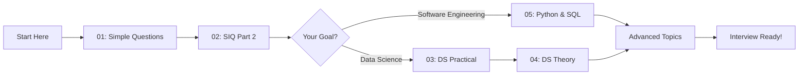

# Daily Interview Prep Repository

<div align="center">


[](https://github.com)
[](https://github.com)
[](https://github.com)
[](https://github.com)
[](LICENSE)

**Your daily dose of interview questions and comprehensive answers**

*An open-source, collaborative platform for interview preparation*

**Fork • Contribute • Learn Together**

[View Repository](#) • [Start Contributing](#contributing) • [Report Issue](#) • [Request Topic](#)

</div>

---

## Table of Contents

- [Overview](#overview)
- [Repository Structure](#repository-structure)
- [Available Topics](#available-topics)
- [How to Use This Repository](#how-to-use-this-repository)
- [Contributing](#contributing)
  - [How to Fork and Contribute](#how-to-contribute---step-by-step)
  - [Contribution Guidelines](#contribution-guidelines)
- [Daily Update Schedule](#daily-update-schedule)
- [Learning Path](#learning-path)
- [Roadmap](#roadmap)
- [Connect With Me](#connect-with-me)
- [Author](#author)
- [License](#license)

---

## Overview

Welcome to the **Daily Interview Prep Repository**, an open-source, community-driven collection of interview questions and detailed answers designed to help you ace your technical interviews. This repository is actively maintained and updated daily with new content across various domains including Data Science, Python, SQL, and general programming concepts.

### What Makes This Repository Special?

- **Open Source & Collaborative**: Anyone can fork, contribute, and improve the content
- **Daily Updates**: Fresh content added every single day
- **Community Driven**: Your contributions make this resource better for everyone
- **Organized Structure**: Questions categorized by difficulty and topic
- **Comprehensive Answers**: Detailed explanations, not just solutions
- **Real-World Scenarios**: Questions based on actual interview experiences
- **Multi-Domain Coverage**: From basics to advanced data science concepts
- **Continuously Evolving**: Regular additions based on latest industry trends

### Open Source Philosophy

This is a **free and open-source project**. We believe in the power of collaborative learning and knowledge sharing. Whether you're a beginner or an expert, your contributions are valuable and welcome!

---

## Repository Structure

This repository is organized into clearly defined folders for easy navigation and progressive learning:

```
Daily-Interview-Prep/
│
├── 01-Simple-Interview-Questions/
│   ├── README.md
│   ├── questions/
│   └── answers/
│
├── 02-SIQ-Part-2/
│   ├── README.md
│   ├── questions/
│   └── answers/
│
├── 03-Data-Science-Sample-Interview-Questions-Practical/
│   ├── README.md
│   ├── coding-challenges/
│   ├── case-studies/
│   └── solutions/
│
├── 04-Data-Science-Sample-Interview-Questions-Theory/
│   ├── README.md
│   ├── concepts/
│   ├── algorithms/
│   └── explanations/
│
├── 05-Python-SQL-Interview-Questions/
│   ├── README.md
│   ├── python/
│   ├── sql/
│   └── combined-challenges/
│
└── README.md
```

---

## Available Topics

### Current Folders

<table>
<tr>
<td width="50%">

#### 01 - Simple Interview Questions


Foundational questions covering basic programming concepts, logical reasoning, and fundamental technical knowledge. Perfect for those starting their interview preparation journey.

**Topics Covered:**
- Basic programming concepts
- Logic and reasoning
- Fundamental data structures
- Simple algorithms
- Core CS principles

</td>
<td width="50%">

#### 02 - SIQ Part 2


Advanced simple interview questions building upon the fundamentals with more complex scenarios and problem-solving challenges.

**Topics Covered:**
- Intermediate algorithms
- Problem-solving patterns
- Code optimization
- Edge case handling
- Complex scenarios

</td>
</tr>
<tr>
<td width="50%">

#### 03 - Data Science Practical Questions


Hands-on practical questions featuring real-world data science problems, coding challenges, and implementation tasks.

**Topics Covered:**
- Data manipulation & cleaning
- Statistical analysis
- Machine learning implementation
- Model evaluation
- Feature engineering
- Real-world case studies

</td>
<td width="50%">

#### 04 - Data Science Theory Questions


Theoretical foundations of data science including algorithms, statistics, machine learning concepts, and mathematical principles.

**Topics Covered:**
- Statistical concepts
- ML algorithms theory
- Mathematics for DS
- Probability & distributions
- Model architecture
- Best practices

</td>
</tr>
<tr>
<td colspan="2">

#### 05 - Python & SQL Interview Questions


Comprehensive coverage of Python and SQL questions ranging from syntax to advanced database queries and Python programming challenges.

**Topics Covered:**
- Python fundamentals to advanced
- Data structures in Python
- SQL query optimization
- Database design
- OOP in Python
- Complex joins & subqueries

</td>
</tr>
</table>

---

## How to Use This Repository

### For Beginners

1. **Start Sequential**: Begin with folder `01-Simple-Interview-Questions`
2. **Practice Daily**: Commit to solving at least 3-5 questions daily
3. **Understand, Don't Memorize**: Focus on understanding concepts, not just answers
4. **Track Progress**: Star questions you found difficult for review

### For Intermediate Learners

1. **Focus on Weak Areas**: Identify topics you struggle with
2. **Time Yourself**: Practice questions under timed conditions
3. **Review Solutions**: Compare your answers with provided solutions
4. **Take Notes**: Document your learning journey

### For Advanced Practitioners

1. **Challenge Yourself**: Attempt questions without looking at hints
2. **Optimize Solutions**: Try to improve provided solutions
3. **Contribute Back**: Share alternative approaches or improvements
4. **Mock Interviews**: Use questions for peer interview practice

### Study Tips

```
┌─────────────────────────────────────────┐
│  Daily Interview Prep Routine           │
├─────────────────────────────────────────┤
│  1. Review 1 previous question          │
│  2. Attempt 3 new questions             │
│  3. Study provided solutions            │
│  4. Note down key concepts              │
│  5. Practice similar problems           │
└─────────────────────────────────────────┘
```

---

## Daily Update Schedule

<div align="center">

### Update Commitment

| Day | New Questions | Topics | Review |
|-----|---------------|--------|--------|
| Monday | 5-7 | Mixed Topics | Weekend Questions |
| Tuesday | 5-7 | Python/SQL | Monday Questions |
| Wednesday | 5-7 | Data Science | Tuesday Questions |
| Thursday | 5-7 | Practical Problems | Wednesday Questions |
| Friday | 5-7 | Theory & Concepts | Thursday Questions |
| Weekend | 3-5 | Mixed/Advanced | Weekly Recap |

</div>

### What to Expect

- **Consistent Updates**: New content pushed daily between 6 PM - 10 PM IST
- **Quality Over Quantity**: Each question comes with detailed explanations
- **Community Driven**: Topics selected based on industry trends and requests
- **Version Control**: All updates documented in commit messages

---

## Learning Path

### Recommended Study Sequence



### Skill Development Timeline

<table>
<tr>
<th>Week</th>
<th>Focus Area</th>
<th>Expected Outcome</th>
</tr>
<tr>
<td>1-2</td>
<td>Fundamentals (Folders 01-02)</td>
<td>Strong foundation in basics</td>
</tr>
<tr>
<td>3-4</td>
<td>Python & SQL (Folder 05)</td>
<td>Proficiency in core tools</td>
</tr>
<tr>
<td>5-6</td>
<td>DS Practical (Folder 03)</td>
<td>Hands-on problem solving</td>
</tr>
<tr>
<td>7-8</td>
<td>DS Theory (Folder 04)</td>
<td>Deep conceptual understanding</td>
</tr>
<tr>
<td>9+</td>
<td>Mock Interviews & Review</td>
<td>Interview confidence</td>
</tr>
</table>

---

## Contributing

**This is an open-source project and we welcome contributions from everyone!** Whether you're fixing a typo or adding an entire section of questions, your contribution matters.

### Why Contribute?

- **Help Others Learn**: Your knowledge can help someone land their dream job
- **Build Your Portfolio**: Showcase your expertise and collaboration skills
- **Learn Together**: Teaching others reinforces your own understanding
- **Join a Community**: Connect with like-minded learners and professionals
- **It's Easy**: Simple process to fork, modify, and submit

### Ways to Contribute

<table>
<tr>
<td width="50%">

#### Add New Questions
Share interesting interview questions you've encountered in real interviews or found challenging during your preparation.

**What to Include:**
- Clear problem statement
- Difficulty level
- Expected answer/solution
- Explanation of concepts
- Time/space complexity (if applicable)

</td>
<td width="50%">

#### Improve Existing Answers
Found a better solution? Have a clearer explanation? Please share it!

**How to Help:**
- Add alternative solutions
- Improve code efficiency
- Clarify explanations
- Add visual diagrams
- Include edge cases

</td>
</tr>
<tr>
<td width="50%">

#### Fix Errors & Typos
Help maintain quality by correcting mistakes.

**What to Fix:**
- Typos and grammar
- Code bugs
- Incorrect answers
- Broken links
- Formatting issues

</td>
<td width="50%">

#### Add Resources & References
Enhance learning with additional materials.

**What to Add:**
- Helpful articles
- Video tutorials
- Practice platforms
- Documentation links
- Related topics

</td>
</tr>
</table>

### How to Contribute - Step by Step

#### Quick Start Guide

```bash
# 1. Fork this repository
Click the 'Fork' button at the top right of this page

# 2. Clone your forked repository
git clone https://github.com/YOUR-USERNAME/daily-interview-prep.git

# 3. Navigate to the project directory
cd daily-interview-prep

# 4. Create a new branch for your contribution
git checkout -b add-new-questions

# 5. Make your changes
# Add questions, improve answers, fix errors, etc.

# 6. Commit your changes
git add .
git commit -m "Add: 5 new Python questions on decorators"

# 7. Push to your forked repository
git push origin add-new-questions

# 8. Create a Pull Request
Go to your fork on GitHub and click 'New Pull Request'
```

### Contribution Guidelines

To ensure consistency and quality across the repository, please follow these guidelines:

#### For Questions

```markdown
### Question: [Title of Question]

**Difficulty:** [Beginner/Intermediate/Advanced]  
**Topic:** [Python/SQL/Data Science/etc.]  
**Asked By:** [Company Name - Optional]

**Problem Statement:**
Clear description of the problem...

**Example:**
```
Input: ...
Output: ...
```

**Constraints:**
- List any constraints or assumptions
```

#### For Answers

```markdown
### Answer: [Title]

**Approach:**
Explain the approach and thought process...

**Solution:**
```python
# Well-commented code
def solution():
    pass
```
```
**Explanation:**
Step-by-step breakdown...

**Time Complexity:** O(n)  
**Space Complexity:** O(1)

**Alternative Approaches:**
Discuss other possible solutions...
```

### Pull Request Process

1. **Update Documentation**: If you're adding new folders or major changes, update the main README
2. **Test Your Code**: Ensure all code solutions run correctly
3. **Follow Format**: Maintain consistency with existing structure
4. **Descriptive Title**: Use clear PR titles like "Add: 10 SQL JOIN questions" or "Fix: Typo in Python basics"
5. **Detailed Description**: Explain what you've added or changed and why
6. **Be Patient**: Maintainers will review your PR and may request changes

### Contribution Standards

 **DO:**
- Write clear, well-commented code
- Provide detailed explanations
- Test your solutions before submitting
- Follow the existing file structure
- Include examples where helpful
- Reference sources when applicable
- Be respectful in discussions

 **DON'T:**
- Copy-paste from other sources without attribution
- Submit untested code
- Make unrelated changes in a single PR
- Include offensive or inappropriate content
- Submit duplicate questions without adding value

### Recognition for Contributors

All contributors will be acknowledged! Your name will be added to our contributors list, and significant contributions will be highlighted in release notes.

<div align="center">

[](https://github.com/yourusername/daily-interview-prep/graphs/contributors)

</div>

### First Time Contributing?

**Don't worry!** Everyone was a beginner once. Here are some beginner-friendly tasks:

- Fix typos or grammar mistakes
- Improve code comments
- Add examples to existing questions
- Format existing content
- Add links to useful resources

Look for issues labeled with `good-first-issue` or `help-wanted` to get started.

### Need Help?

If you're unsure about anything:

1. Check existing questions and pull requests for examples
2. Open an issue to discuss your idea before working on it
3. Reach out via [email](mailto:your.email@example.com) or social media
4. Join our community discussions

**Remember:** Every contribution, no matter how small, makes a difference!

---

## Roadmap

### Upcoming Additions

<div align="center">

| Status | Topic | Expected Date |
|:------:|-------|---------------|
| ⏳ | System Design Questions | Q1 2026 |
| ⏳ | Machine Learning Projects | Q2 2026 |
| ⏳ | Behavioral Interview Guide | Q1 2026 |
| ⏳ | Advanced SQL Optimization | Q2 2026 |
| ⏳ | Cloud Computing Questions | Q2 2026 |
| 📝 | LeetCode Style Problems | In Planning |

</div>

### Future Folders

- `06-System-Design-Interview-Questions`
- `07-Behavioral-Interview-Questions`
- `08-Advanced-Machine-Learning`
- `09-Cloud-Computing-Questions`
- `10-Full-Stack-Development`

---

## Connect With Me

I'm constantly working to improve this repository. Your feedback, suggestions, and questions are always welcome!

<div align="center">

### Let's Stay Connected

[](https://github.com)
[](https://linkedin.com)
[](https://twitter.com)
[](mailto:your.email@example.com)

</div>

### Support This Project

If you find this repository helpful, please consider:

- **Starring** ⭐ the repository to show your support
- **Forking** 🍴 and contributing your own questions and answers
- **Sharing** 📢 with friends, colleagues, and study groups
- **Opening Issues** 💡 for suggestions and improvements
- **Creating Pull Requests** 🔧 to enhance the content
- **Providing feedback** 💬 on content quality and usefulness

**Every star, fork, and contribution helps this project reach more learners!**

---

## Author

<div align="center">


**Vinod Bavage**

*Passionate about education, technology, and helping others succeed in their career journey*

[](https://vinod-portfolio.pages.dev/)

### About Me

I'm a dedicated developer and educator committed to creating high-quality educational resources for the tech community. This repository represents my effort to give back to the community and help aspiring professionals prepare for their dream jobs.

**Mission**: To provide free, comprehensive, and accessible interview preparation materials for everyone.

</div>

---

## Acknowledgments

Special thanks to:

- **All Contributors**: Everyone who has forked, contributed, and improved this repository
- **The Open Source Community**: For inspiration and best practices in collaborative learning
- **Interview Candidates**: Who share their experiences and questions
- **Industry Professionals**: Who provide feedback and validate content quality
- **You**: For using and supporting this project

**This repository is powered by community collaboration. Thank you for being part of it!**

---

## License

This project is licensed under the MIT License - see the [LICENSE](LICENSE) file for details.

### Usage Rights

You are free to:
-  Fork this repository and create your own version
-  Use this content for personal interview preparation
-  Modify questions and add your own answers
-  Share with others who might benefit
-  Use in educational settings and study groups
-  Create pull requests to improve the original repository
-  Build upon the content with proper attribution

**This is open source - we encourage you to fork, learn, contribute, and share!**

**Please provide attribution when sharing or reusing content.**

---

<div align="center">

### Repository Statistics


---

### Stay Updated

**New questions added daily!** Watch this repository to get notifications for updates.

[](https://github.com)

---

**Happy Learning! Best of luck with your interviews!**

*Last Updated: January 2026*

**Made with dedication by [Vinod Bavage](https://vinod-portfolio.pages.dev/)**

</div>
